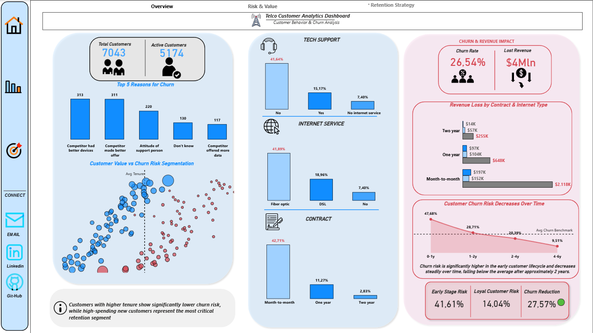
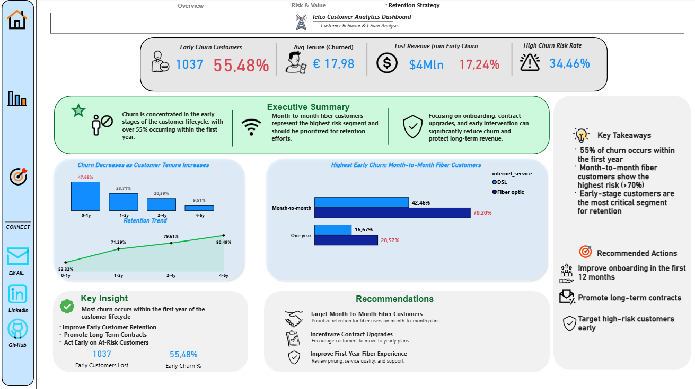

# 📊 Telco Customer Churn Analysis Dashboard

<div align="center">


</div>

---

## 🚀 Overview

This project is an **end-to-end data analysis** focused on customer churn in the telecom industry.

The objective is to **analyze customer behavior, identify high-risk segments, and provide actionable retention strategies**.

👉 Full pipeline:
**Python (ETL) → SQL (Analysis) → Power BI (Visualization)**

---

## 🧠 Objectives

- Understand customer churn patterns  
- Identify high-risk and high-value customers  
- Analyze drivers of churn  
- Provide business recommendations  

---

## 🛠️ Tools & Technologies

<div align="center">


</div>

---

## 🔄 Project Workflow

### 1️⃣ Data Preparation (Python)

- Data loading and exploration  
- Data cleaning (nulls, duplicates, type conversion)  
- Outlier detection (IQR method)  
- Feature preparation  
- Data ready for SQL integration  

---

### 2️⃣ Data Analysis (SQL)

- Churn rate calculation  
- Segmentation by:
  - Contract type  
  - Tenure  
  - Payment method  
  - Internet service  
- Customer value analysis  
- High-value churn detection  

---

### 3️⃣ Data Visualization (Power BI)

Interactive dashboard with **3 analytical layers**:

---

## 📊 Dashboard Preview

### 🏠 Overview


- Customer base overview  
- Churn drivers  
- Behavioral patterns  

---

### 📈 Risk & Value


- Customer segmentation:
  - 🔴 Critical (High Value + High Risk)  
  - 🟡 At Risk  
  - 🟢 Low Priority  
  - 🔵 Stable  

---

### 🎯 Retention Strategy


- Early churn focus  
- Executive insights  
- Strategic actions  

---

## 🔍 Key Insights

- 📌 **55%+ of churn occurs within the first year**  
- ⚡ **Month-to-month fiber customers = highest risk segment (~70%)**  
- 📉 Long-term contracts significantly reduce churn  
- 💰 High-value customers with high churn risk are the top priority  

---

## 🎯 Business Recommendations

- 🚀 Improve onboarding in the first 12 months  
- 📑 Promote long-term contracts  
- 🎯 Target high-risk customers early  
- 🔧 Improve service quality for fiber users  
- 💡 Focus retention on high-value segments  

---

## 💡 Business Impact

Reducing churn can:

- Increase **Customer Lifetime Value (CLTV)**  
- Improve retention rates  
- Protect long-term revenue  
- Enable data-driven decision making  

---

## 📁 Repository Structure

```text
telco-churn-powerbi-dashboard/
│
├── data/
├── etl/
│   └── pulizia etl.ipynb
│
├── images/
│   ├── 0_Home.png
│   ├── 1_Rick & Value.png
│   └── 2_Strategy.png
│
├── report/
│   └── Dashboard Telco.pbix
│
├── sql/
│   └── churn_analysis.sql
│
└── README.md

## 🤝 Connect with Me

Se ti è piaciuto il progetto o vuoi collaborare 👇

<div align="center">

<a href="https://www.linkedin.com/in/giuseppe-massaro/" target="_blank">
  
</a>

<br><br>

<a href="https://giuseppe-massaro-portafoglio.netlify.app/" target="_blank">
  
</a>

<br><br>

<a href="mailto:massaro.98@hotmail.it">
  
</a>

</div>

---

## ⭐ Support

Se questo progetto ti è stato utile:

👉 lascia una ⭐ al repository  
👉 condividilo su LinkedIn  

---

## 👨‍💻 Author

**Giuseppe Massaro**  
Aspiring Data Analyst 🚀
